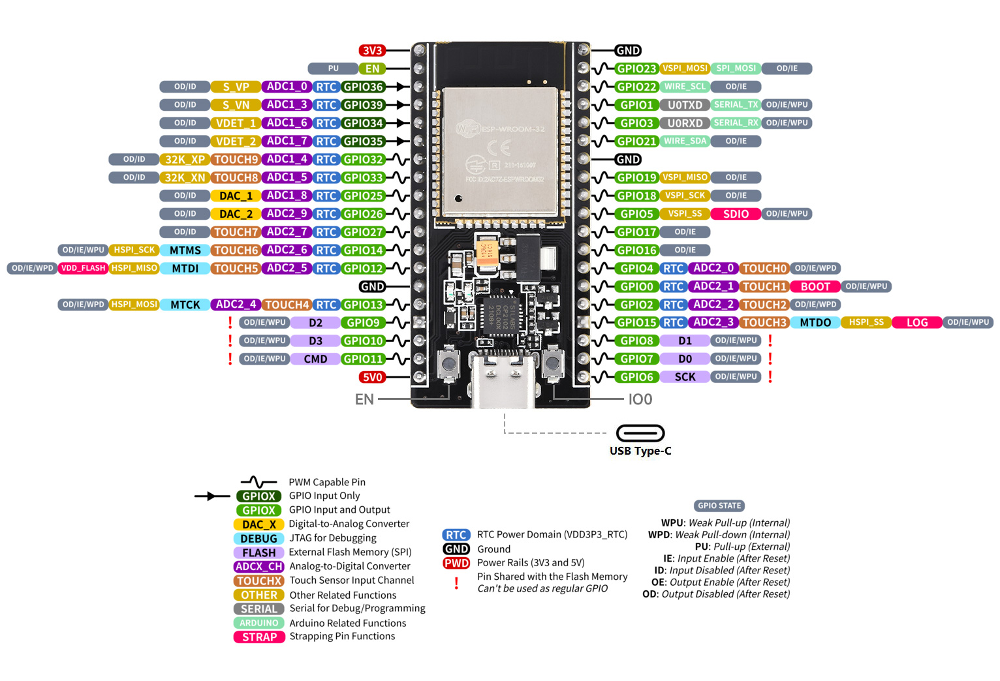

# Lâmpada de Lava

## Links para fazer a lampada

- [Manual do mundo (o liquido da lampada)](https://youtu.be/LcSW7O56B-0)
- [Playlist](https://www.youtube.com/playlist?list=PLz-Y5rwxaF8qEKzLQ9h6xIV0C33PYyxBU)

## ESP 32 pinout

## Tarefas

- [pdf das tarefas]()

## Codigos teste

- [Sensor de moviemnto](./teste_pir/teste_pir.ino)
- [Aquecedor de cartucho](./teste_rele/teste_rele.ino)
- [Codigo com tempo sem delay](teste_tempo_sem_delay.ino)

## Código trabalho

## Tinkercad

- [Link do projeto no tinkercad](https://www.tinkercad.com/things/4kXaNSLRbeD?sharecode=p3JFwybaUJIMXSC5MJte0VQfITPpRgQib_tJfDL0w-U)