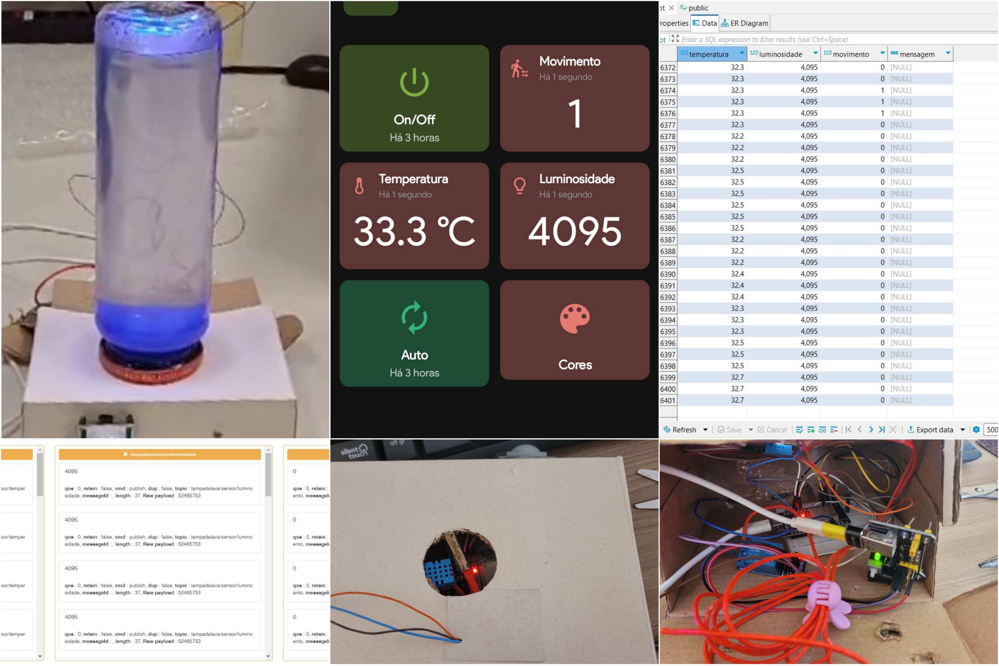
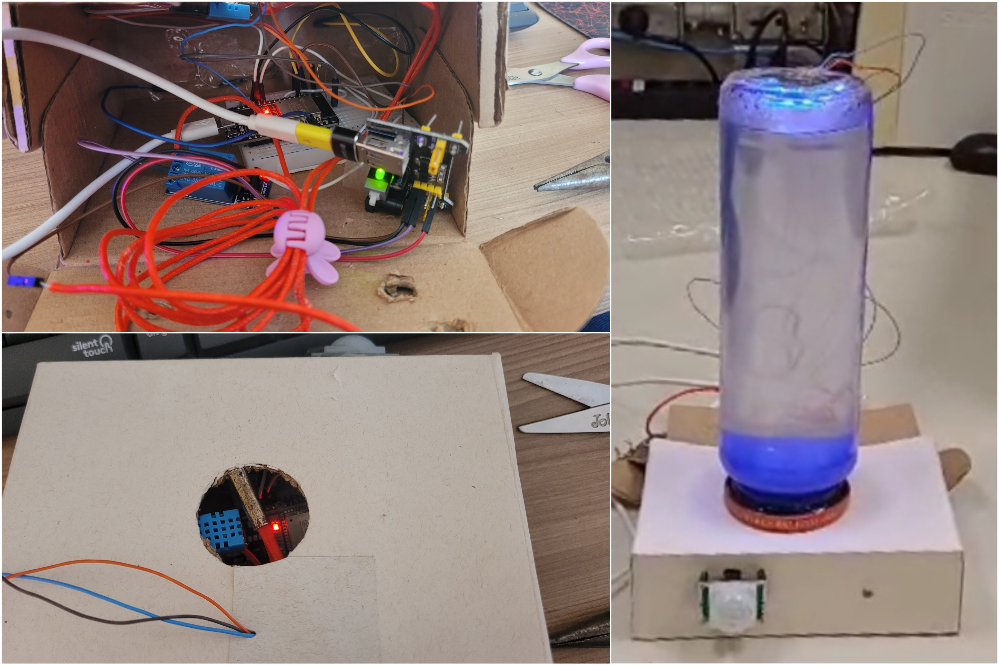
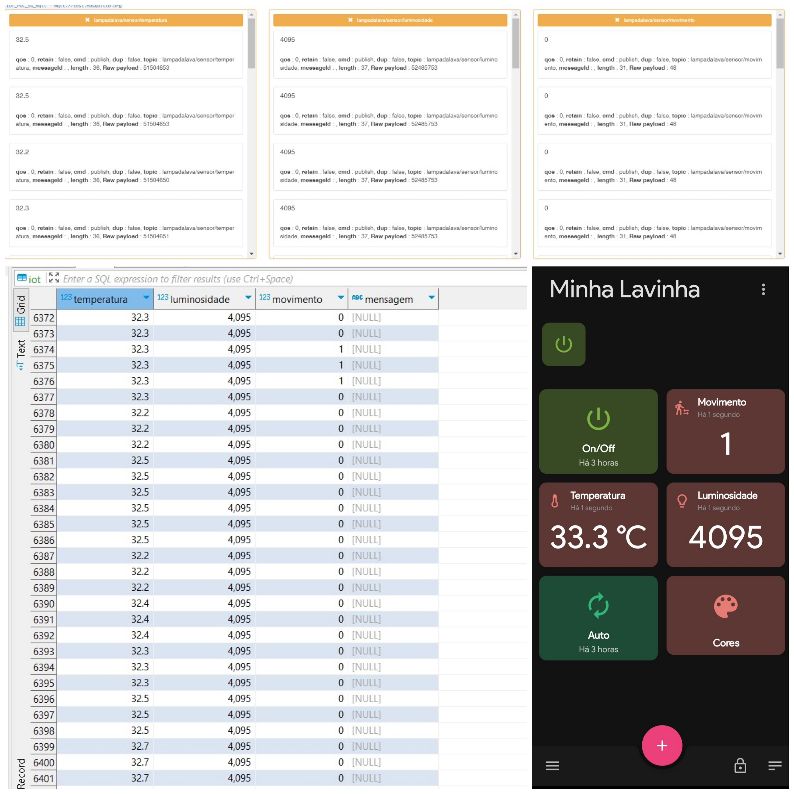

#

## Sumário

- [Sobre](#sobre)
- [Inspirações](#inspirações)
- [Funcionalidades](#funcionalidades)
- [Hardware](#hardware)
- [Software](#software)
- [Mais detalhes](#mais-detalhes)
- [Clonar projeto](#clonar-projeto)
- [Créditos](#créditos)

## Sobre

Esse projeto foi desenvolvido na matéria Internet das Coisas (IoT) no 3º período da faculdade de Engenharia de Computação, com o principal objetivo de elaborar uma Lâmpada de Lava Inteligente. 

Essa lâmpada possui a habilidade de se autorregular, de acordo com o ambiente, também pode ser controlada por um usuário. Nesse sentido, sua autorregulagem consiste na capacidade de perceber a presença de uma pessoa para ligar ou desligar seu sistema, e captar a luminosidade do ambiente para regular a intensidade da sua luz RGB, além de monitorar a sua própria temperatura evitando a quebra do material e danos ao circuito. Além disso, o usuário é capaz de configurar, através do aplicativo, a cor da luz RGB, ativar o modo automático da cor, que consiste na mudança de cor aleatoriamente, e ligar ou desligar o sistema.    

Apesar de tal lâmpada ser, popularmente, utilizado como um objeto de decoração, os conceitos utilizados para controlá-la podem ser replicados para outros aparelhos em uma casa automatizada. Portanto, nosso principal objetivo é criar um projeto visualmente atraente e altamente replicável, que possa ser usado como modelo para automação residencial. 


## Inspirações

A principal motivação para esse trabalho era fazer algo diferente e visualmente atraente. Apesar de não solucionar problema sociais, utiliza elementos facilmente aplicáveis a projetos de casas automatizadas, mas que não são regularmente vistos nesses projetos.

Veja os videos em que o projeto foi baseado:

- [Playlist](https://www.youtube.com/playlist?list=PLz-Y5rwxaF8qEKzLQ9h6xIV0C33PYyxBU)

## Funcionalidades

- Controle de luminosidade da LED, através de um sensor de luminosidade
- Controle da cor da LED, através de um aplicativo
- Controle de ligar e desligar no aplicativo
- Após um tempo determinado sem a detecção de movimento, o sistema desligar
- Controle do aquecedor de cartucho 3D com a temperatura lida pelo sensor
- Publicação dos dados lidos pelos sensores em um Banco de dados e em um aplicativo
- Armazenamento dos comandos lidos no Banco de dados

## Hardware

### Diagrama Elétrico


<div align="center">
    
</div>

*Legenda:*

<div align="center">
    
</div>

*Mais detalhes:*

Uma representação do hardware está disponível no tinkercad:

- [Link do projeto no tinkercad](https://www.tinkercad.com/things/4kXaNSLRbeD?sharecode=p3JFwybaUJIMXSC5MJte0VQfITPpRgQib_tJfDL0w-U)

### Fotos do Hardware



## Software

### Fluxograma


### Programas Utilizados

#### Devices

Para o código do hardware foi utilizado alinguagem C++ e desenvolvido no Arduino IDE.

Para que o código funcione é necessario as bibliotecas:
- [Adafruit_Sensor-master](./bibliotecas/Adafruit_Sensor-master.zip)
- [DHT-sensor-library](./bibliotecas/DHT-sensor-library.zip)
- [PubSubClient-2.8.0](./bibliotecas/PubSubClient-2.8.0.zip)
- Adafruit_NeoPixel

Veja o código do hardware produzido: [vizualizar código](./Listagem%20dos%20Programas/lampada_de_lava.ino)

#### Bancos de Dados

Para o banco de dados foi utilizado o postgree
Visualize o codigo em python que possibilita a conexao do ESP-32 com banco de dados: [ver código](./Listagem%20dos%20Programas/bd/)

#### Aplicativo

O aplicativo foi desenvolvido no MQTT DashBoard, caso queira ter o aplicativo, baixe ele na play store e o arquivo backup em seu celular ([vizualizar arquivo backup](./Listagem%20dos%20Programas/backup_app_MQTTDashBoard.mqttdash))

Selecione as opções `Restore backup` > `Restore`, selecione o arquivo backup baixado e confirme nas opções `ok` > `Restart`.

### Printscreen
<div align="center">
    
</div>

## Mais Detalhes

Para mais detalhes desse projeto veja a documentação e os relatorios produzidos ao longo do trabalho.

- [Ver documentação](./Relatorios/Documenta%C3%A7%C3%A3o.pdf)
- [Ver relatorios](./Relatorios)

## Clonar Projeto

```
git clone https://github.com/Paula-Talim/IOT_lampada_de_lava.git
```
```
cd IOT_lampada_de_lava
```

## Créditos

### Integrantes do Grupo

- Ana Beatriz Santos de Oliveira
- [Marcos Victor](https://www.linkedin.com/in/marcos-victor-5b45a91a4/)
- [Mariana Aram](https://www.linkedin.com/in/mariana-aram-silva-a766b623b/)
- [Paula Talim](https://www.linkedin.com/in/paulatalim/)
- [Yago Garzon](https://www.linkedin.com/in/yago-garzon-chaves-7b57451b3/)

### Professor Orientador

- [Julio Coway](https://www.linkedin.com/in/julio-conway-d-sc-09092819/)

