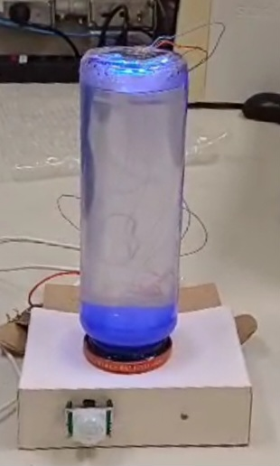
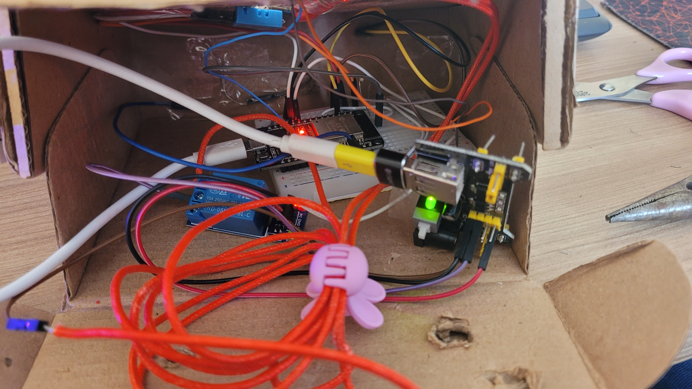
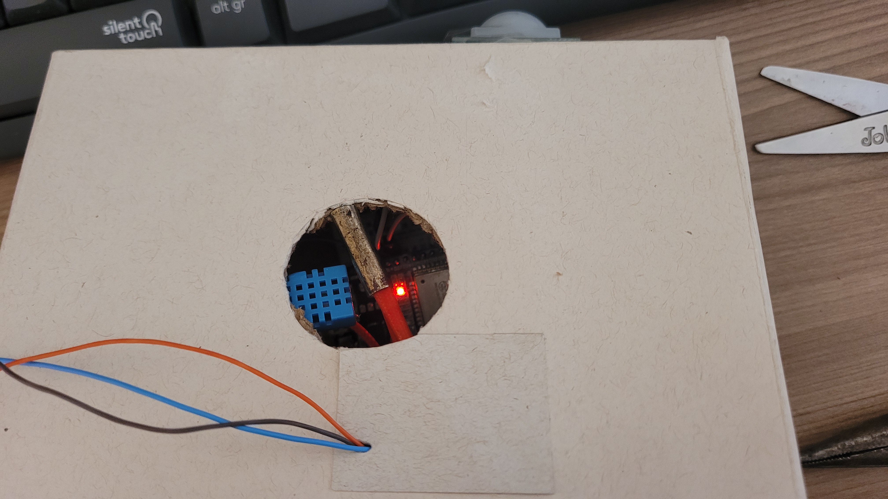

# Lâmpada de Lava



## Sumário
- [Sobre](#sobre-o-sistema)
- [Funcionalidades](#funcionalidades)
- Diagrama Eletrico
- Programas utilizados
- Inspiracoes
- Fotos
- Clonar projeto
- [Créditos](#créditos)

## Sobre
Esse sistema foi uma atividade academica desenvolvida no 1º periodo de faculdade de Engenharia de Computação, com o principal objetivo aprender _________, utilizando a linguagem ______________.

## Inspiracoes

- [Playlist](https://www.youtube.com/playlist?list=PLz-Y5rwxaF8qEKzLQ9h6xIV0C33PYyxBU)

## Funcionalidades


## Hardware

### Diagrama Eletrico


Uma representação do hardware está disponível no tinkercad:

- [Link do projeto no tinkercad](https://www.tinkercad.com/things/4kXaNSLRbeD?sharecode=p3JFwybaUJIMXSC5MJte0VQfITPpRgQib_tJfDL0w-U)

### Fotos do Hardware





## Clonar Projeto

```
$ git clone link
```

## Créditos

### Integrantes do grupo

- Ana Beatriz
- Marcos Victor
- Mariana Aram
- Paula Talim
- Yago Garzon

### Professor orientador

- Julio Coway

