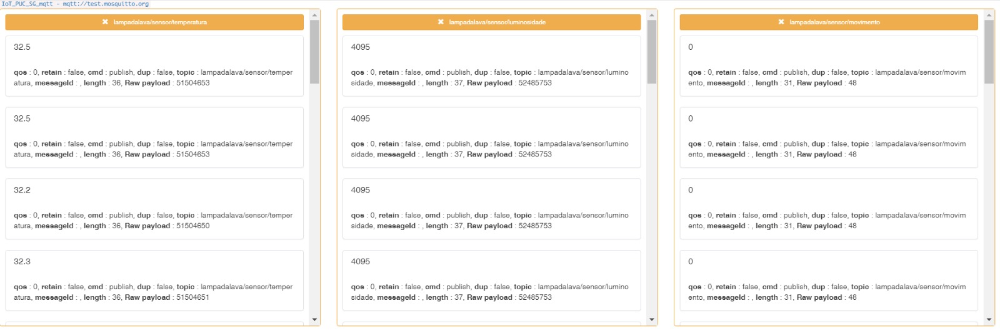
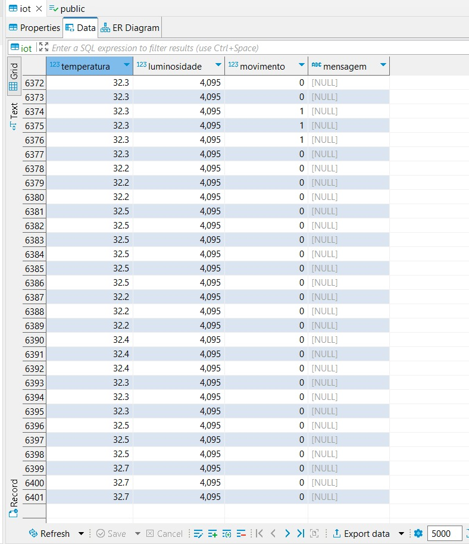
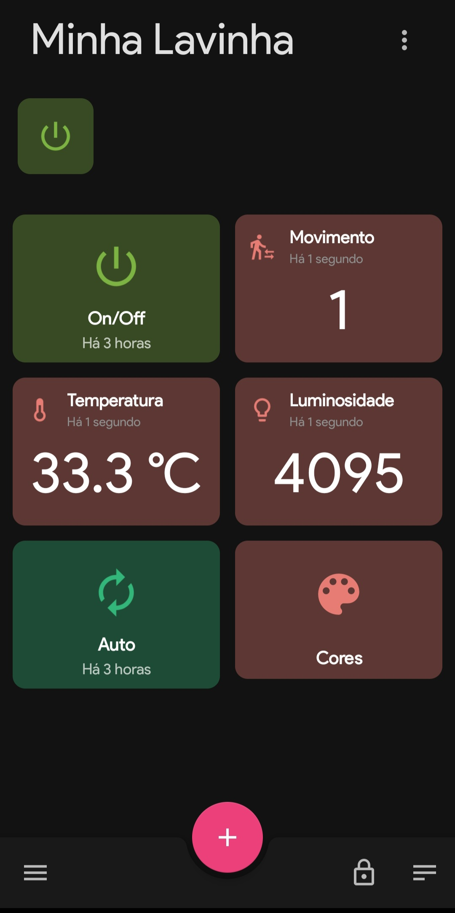

<div align="center">
    <h1> Lâmpada de Lava </h1>
    
</div>

#

## Sumário
- [Sobre](#sobre-o-sistema)
- Inspiracoes
- [Funcionalidades](#funcionalidades)
- Hardware
- Software
- Mais detalhes
- Clonar projeto
- [Créditos](#créditos)

## Sobre

Esse projeto foi desenvolvido na matéria Internet das Coisas (IoT) no 3º período da faculdade de Engenharia de Computação, com o principal objetivo de elaborar uma Lâmpada de Lava Inteligente. 

Essa lâmpada possui a habilidade de se autorregular, de acordo com o ambiente, também pode ser controlada por um usuário. Nesse sentido, sua autorregulagem consiste na capacidade de perceber a presença de uma pessoa para ligar ou desligar seu sistema, e captar a luminosidade do ambiente para regular a intensidade da sua luz RGB, além de monitorar a sua própria temperatura evitando a quebra do material e danos ao circuito. Além disso, o usuário é capaz de configurar, através do aplicativo, a cor da luz RGB, ativar o modo automático da cor, que consiste na mudança de cor aleatoriamente, e ligar ou desligar o sistema.    

Apesar de tal lâmpada ser, popularmente, utilizado como um objeto de decoração, os conceitos utilizados para controlá-la podem ser replicados para outros aparelhos em uma casa automatizada. Portanto, nosso principal objetivo é criar um projeto visualmente atraente e altamente replicável, que possa ser usado como modelo para automação residencial. 


## Inspiracoes

A principal motivação para esse trabalho era fazer algo diferente e visualmente atraente. Apesar de não solucionar problema sociais, utiliza elementos facilmente aplicáveis a projetos de casas automatizadas, mas que não são regularmente vistos nesses projetos.

Veja os videos em que o projeto foi baseado:

- [Playlist](https://www.youtube.com/playlist?list=PLz-Y5rwxaF8qEKzLQ9h6xIV0C33PYyxBU)

## Funcionalidades

- Controle de luminosidade da LED, através de um sensor de luminosidade
- Controle da cor da LED, através de um aplicativo
- Controle de ligar e desligar no aplicativo
- Após um tempo determinado sem a detecção de movimento, o sistema desligar
- Controle do aquecedor de cartucho 3D com a temperatura lida pelo sensor
- Publicação dos dados lidos pelos sensores em um Banco de dados e em um aplicativo
- Armazenamento dos comandos lidos no Banco de dados

## Hardware

### Diagrama Eletrico


Uma representação do hardware está disponível no tinkercad:

- [Link do projeto no tinkercad](https://www.tinkercad.com/things/4kXaNSLRbeD?sharecode=p3JFwybaUJIMXSC5MJte0VQfITPpRgQib_tJfDL0w-U)

### Fotos do Hardware


## Software

### Programas utilizados

### Printscreen





## Clonar Projeto

    git clone https://github.com/Paula-Talim/IOT_lampada_de_lava.git

```
git clone https://github.com/Paula-Talim/IOT_lampada_de_lava.git
```
```
cd IOT_lampada_de_lava
```
## Mais Detalhes

## Créditos

### Integrantes do grupo

- Ana Beatriz
- Marcos Victor
- Mariana Aram
- Paula Talim
- Yago Garzon

### Professor orientador

- Julio Coway

